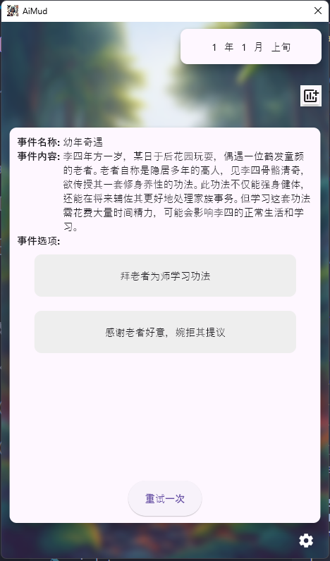

# ai_mud

a mud game built with flutter and LLM

## Changelog

* 0.1.2 (unreleased)
  - refactor `event`

* 0.1.1 (unreleased)
  - refactor `history`
  - add `showcase`
  - add `moveNext()` function
  - rewrite some prompts

* 0.1.0 - initial release
